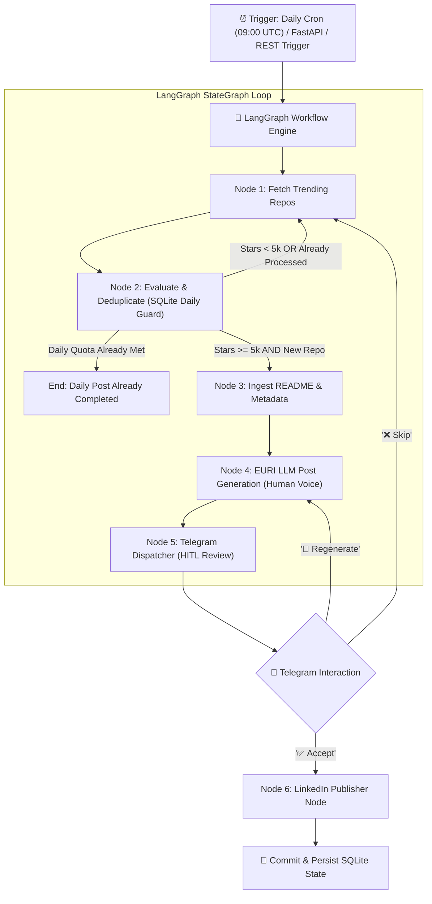

# Product Requirements Document (PRD)
## Autonomous Open-Source Spotlight Agent (GitHub → Telegram HITL → LinkedIn)

---

## 1. Executive Summary & Problem Statement

### 1.1 The Problem
Building a strong personal brand and technical thought leadership on LinkedIn requires consistent, high-value, and deeply technical posts. However:
1. **Time Scarcity**: Manually discovering high-quality trending repositories on GitHub, reading their documentation, extracting architecture details, and writing engaging LinkedIn posts takes **45–60 minutes every day**.
2. **Hallucination & Shallow AI Content**: Standard generative AI tools often hallucinate non-existent features or produce generic, robotic summaries with buzzwords (*"game-changer"*, *"delve"*, *"unleash"*) that harm audience trust and LinkedIn algorithmic reach.
3. **Overposting vs. Quality**: Posting multiple times a day or every 60–70 minutes exhausts audience attention and triggers spam filters. The optimal strategy is **strictly 1 high-impact, deeply authentic post per day**.
4. **Lack of Human Control in Automation**: Fully autonomous posting without human review risks publishing inaccurate or unverified content, while purely manual posting leads to inconsistency and burnout.

### 1.2 The Solution
An autonomous **LangGraph & FastAPI-powered agent** running either on a scheduled daily cron (09:00 AM IST / 03:30 AM UTC) or as a live FastAPI server that:
1. Discovers and filters top-trending GitHub repositories with $> 5\text{k}$ stars.
2. Enforces a **strict 1-post-per-day** rule using SQLite daily cooldown guards.
3. Ingests the actual repository metadata and full `README.md` to guarantee zero hallucinations.
4. Generates an authentic post written in the voice of a real practitioner/engineer using the **EURI API** with calibrated parameters (`max_tokens: 1500`, `temperature: 0.55`).
5. Sends an interactive preview to Telegram for **Human-in-the-Loop (HITL)** approval.
6. Publishes directly to LinkedIn upon one-click approval and persists state to an indexed SQLite database.

---

## 2. System Architecture & Tech Stack



### 2.1 Technology Stack

| Layer | Technology | Rationale |
| :--- | :--- | :--- |
| **Agentic Framework** | **LangGraph (Python)** | Cyclic graph engine with native state checkpoints, conditional routing loops, and robust error recovery. |
| **Web Server & Webhooks** | **FastAPI & Uvicorn** | High-performance asynchronous API server for Telegram webhook callbacks, manual REST triggers, and monitoring. |
| **LLM Inference Gateway** | **EURI Endpoint (`https://api.euron.one/api/v1/euri`)** | OpenAI SDK compatibility with high-performance models (`gpt-4.1-mini`, `gpt-4o`, `gpt-4o-mini`, `claude-3-5-sonnet`, `deepseek-chat`). |
| **Inference Calibration** | **`max_tokens: 1500`, `temperature: 0.55`** | Avoids truncation, balances natural human conversational tone, and anchors strictly to facts. |
| **Cadence / Scheduling** | **Daily Schedule (1 Post / Day)** | Prevents spam; enforced at both trigger and database query layers. |
| **Observability & Tracing** | **LangSmith (`LANGSMITH_TRACING` & `LANGSMITH_API_KEY`)** | Real-time monitoring of LLM calls, prompts, tokens, latencies, HITL graph transitions, and spans. |
| **Persistence / Storage** | **SQLite 3 (`data/history.db`)** | Lightweight, zero-config relational database with daily quota indexing and full history tracking. |
| **Human Review UI** | **Telegram Bot API (Inline Keyboards & Webhooks)** | Mobile-first, zero-latency notification and one-click approval interface. |
| **Target Distribution** | **LinkedIn Community Management REST API** | Official API for publishing technical commentary and post updates. |

---

## 3. Recommended LLM Models (EURI Endpoint)

| Model | Strengths & Characteristics | Recommended Role |
| :--- | :--- | :--- |
| **`gpt-4.1-mini`** *(Configured Default)* | Ultra-fast token generation, high instruction adherence, smart reasoning, and cost-effective. | **Primary Generation Node** |
| **`gpt-4o`** | State-of-the-art reasoning, exceptional natural human tone, zero hallucination when grounded with context. | **Alternative Primary** for nuanced prose |
| **`gpt-4o-mini`** | High speed, reliable structured outputs, budget-friendly. | **Secondary / Fallback** |
| **`claude-3-5-sonnet`** | Industry-leading writing style; avoids generic AI buzzwords (*"delve"*, *"game-changer"*, *"unleash"*) and sounds like a real staff engineer. | **Stylistic Alternative** |
| **`deepseek-chat` / `deepseek-v3`** | Exceptional code reasoning, very low cost, deep technical breakdown. | **Architecture Analysis** |

---

## 4. Human-First Content Engineering Guidelines

To make posts sound like a **real developer or founder** writing from firsthand experience rather than an AI generator:

```
┌─────────────────────────────────────────────────────────────────────────┐
│                       Human Voice Style Card                            │
├─────────────────────────────────────────────────────────────────────────┤
│ 1. Zero AI Clichés: BANNED: "In the fast-paced world...", "Game changer"│
│    "Dive into", "Unleash", "Tapestry", "Delve", "In today's landscape". │
│ 2. First-Person Practitioner Voice: "I was looking into how X solves Y",│
│    "What caught my eye in their architecture...", "The cool trick here".│
│ 3. Deep Architectural Insight: Highlight concrete engineering trade-offs│
│    (memory footprints, zero-copy deserialization, concurrent pipelines).│
│ 4. Clear Structure: Clean whitespace, high-impact opening line, bullet  │
│    points for architecture, and an authentic closing discussion spark.  │
│ 5. First-Comment Link: Keep links out of the main post to maximize reach│
└─────────────────────────────────────────────────────────────────────────┘
```

### Standard Human-Crafted LinkedIn Post Structure
```text
I've been looking into how [Project Name] approaches [Core Engineering Problem]—and their architecture is worth talking about.

Most tools in this space struggle with [Specific Pain Point: e.g. memory overhead / latency / complex configuration]. 

Here is how [Project Name] tackles it differently:

• [Concrete Architectural Choice]: [Why it works, grounded in README]
• [Performance Benchmark / Key Feature]: [Exact metric or capability]
• [Developer Experience Highlight]: [CLI simplicity / clean API / integration]

Under the hood: Built with [Language/Stack] leveraging [Ecosystem/Engine].

Curious if anyone here has deployed this in production yet? How does it compare to your current workflow?

🔗 Dropping the GitHub repo link in the first comment 👇
#SoftwareEngineering #OpenSource #DevCommunity #SystemDesign
```

---

## 5. Database Schema (SQLite)

Located at `data/history.db`:

```sql
CREATE TABLE IF NOT EXISTS posted_repos (
    id INTEGER PRIMARY KEY AUTOINCREMENT,
    repo_full_name TEXT UNIQUE NOT NULL,      -- e.g. 'astral-sh/uv'
    repo_url TEXT NOT NULL,                    -- e.g. 'https://github.com/astral-sh/uv'
    stars_count INTEGER NOT NULL,              -- Total stars at time of selection
    language TEXT,                             -- Primary programming language
    topics TEXT,                               -- JSON or comma-separated tags
    post_content TEXT NOT NULL,                -- Generated LinkedIn post copy
    linkedin_post_urn TEXT,                    -- LinkedIn confirmation URN
    status TEXT CHECK(status IN ('PENDING', 'POSTED', 'SKIPPED', 'REJECTED')) DEFAULT 'PENDING',
    created_at TIMESTAMP DEFAULT CURRENT_TIMESTAMP,
    posted_at TIMESTAMP
);

CREATE INDEX IF NOT EXISTS idx_repo_full_name ON posted_repos(repo_full_name);
CREATE INDEX IF NOT EXISTS idx_status ON posted_repos(status);
CREATE INDEX IF NOT EXISTS idx_posted_at ON posted_repos(posted_at);
```

### Daily Post Cooldown Check
```sql
SELECT COUNT(*) FROM posted_repos 
WHERE date(posted_at) = date('now') AND status = 'POSTED';
```

---

## 6. Project Directory Structure

```text
├── .agent.skills.md               # Agent skills & workflow node definitions
├── skill.store.empty               # Skill store marker file
├── docs/
│   └── PRD.md                     # This Document
├── data/
│   └── history.db                 # SQLite persistence database
├── src/
│   ├── __init__.py
│   ├── config.py                  # Environment variable configuration (EURI, Telegram, LinkedIn)
│   ├── db.py                      # SQLite database connection & 1-post-per-day rate limiting
│   ├── github_client.py           # GitHub trending discovery & README extraction
│   ├── llm_generator.py           # EURI OpenAI client with human-first prompts & parameter tuning
│   ├── telegram_bot.py            # Telegram interactive messaging & button dispatcher
│   ├── linkedin_client.py         # LinkedIn REST API publisher
│   ├── agent_graph.py             # LangGraph state machine definition & workflow nodes
│   └── api.py                     # FastAPI server with webhook receivers and manual triggers
├── main.py                        # Dual-mode entrypoint (CLI daily run / FastAPI daemon)
├── requirements.txt               # Python dependencies
├── .env.example                   # Example environment variables
└── README.md                      # Setup and deployment instructions
```

---

## 7. Success Metrics (KPIs)

1. **Zero Hallucination Rate**: 100% factual alignment with source README files.
2. **Authentic Human Tone**: Posts read naturally without formulaic AI markers.
3. **Cadence Consistency**: Exactly 1 high-quality post published per day.
4. **Execution Reliability**: Graph completes discovery, filtering, generation, and Telegram dispatch in < 15 seconds.
5. **Engagement Impact**: Minimum 2x increase in LinkedIn post saves, comments, and profile visits within 30 days of consistent daily posting.
